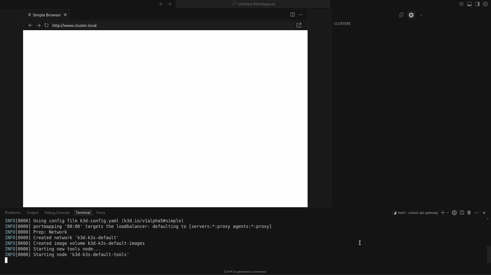
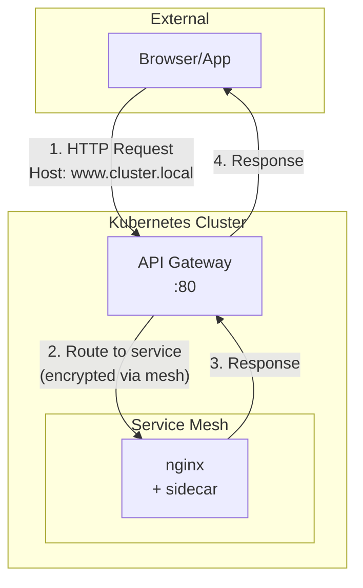
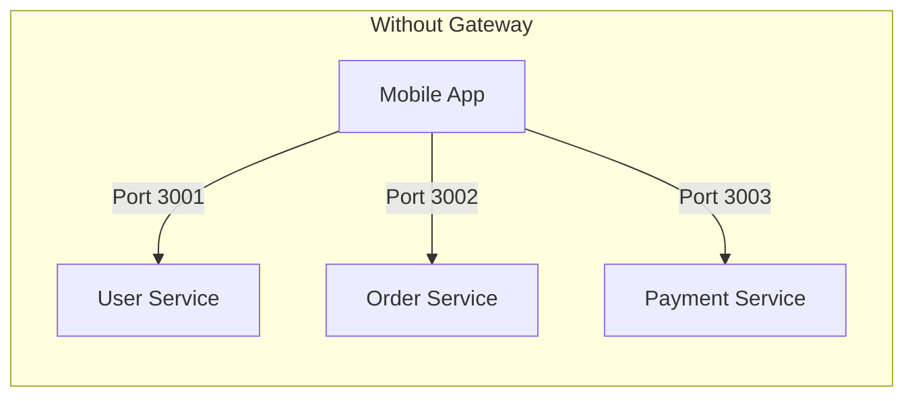
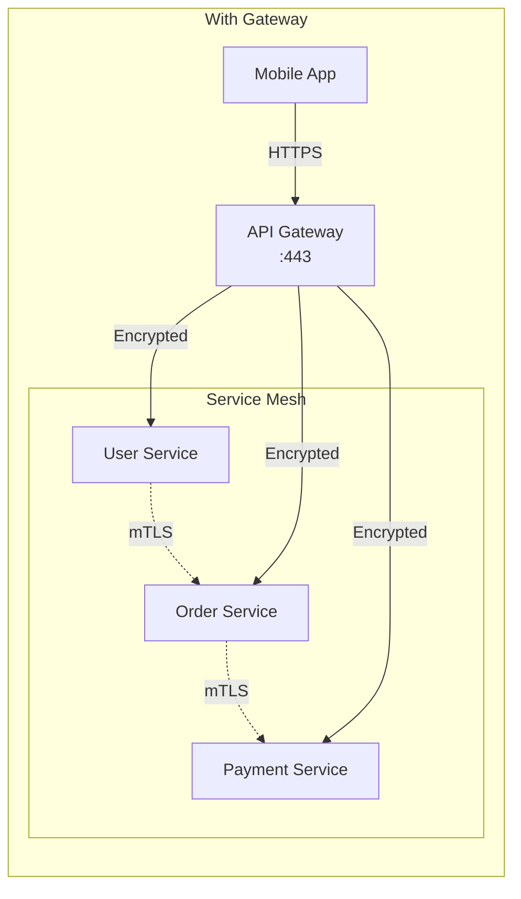
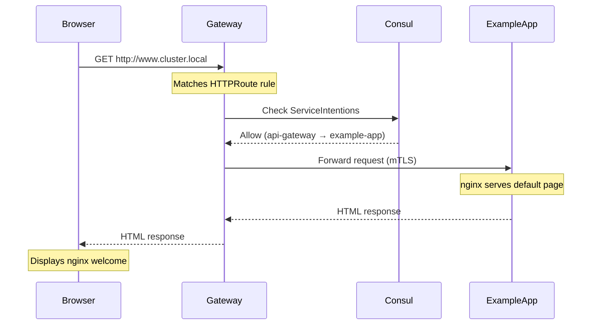
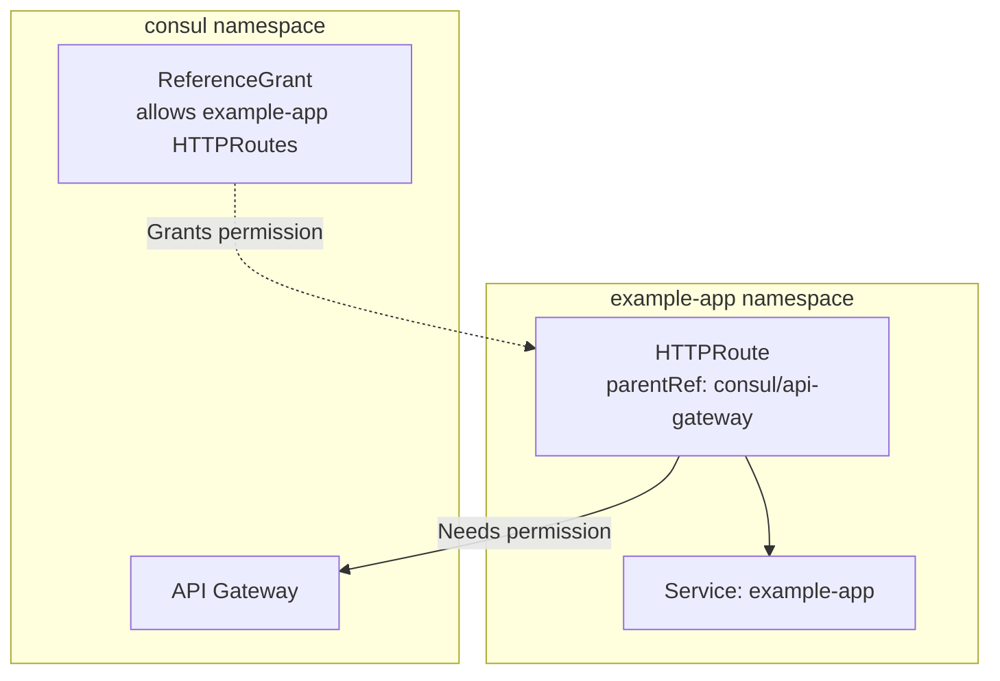
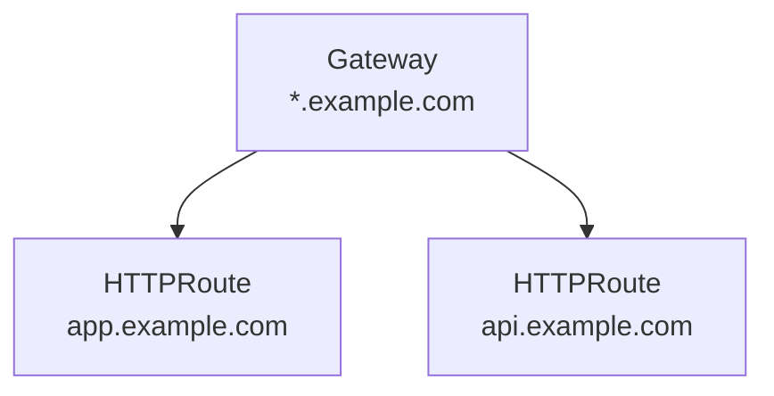
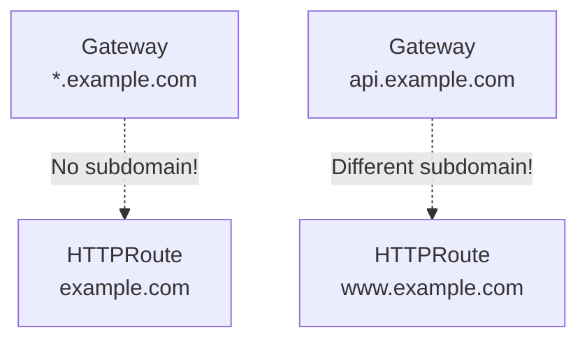

# Consul API Gateway Demo



A minimal Kubernetes API Gateway setup using Consul on k3d. Ready in 2 minutes.

**Versions:** Consul v1.21.4 | Kubernetes v1.31.5 | Gateway API v1.0.0

## TL;DR

```bash
# Install and run everything
./scripts/deploy.sh --yes

# Test it works
curl -H "Host: www.cluster.local" http://localhost/
# Or open browser: http://www.cluster.local

# Clean up
./scripts/destroy.sh --yes
sudo ./scripts/cleanup.sh
```

## Quick Start

### 1. Deploy Everything

```bash
git clone <this-repo>
cd consul-api-gateway
./scripts/deploy.sh
```

The script will:
- ✅ Install k3d and Helm if missing
- ✅ Add `www.cluster.local` to /etc/hosts (IPv4 + IPv6)
- ✅ Create local Kubernetes cluster
- ✅ Deploy Consul service mesh
- ✅ Setup API Gateway
- ✅ Deploy example app
- ✅ Validate everything works

### 2. Test It Works

```bash
# Quick test
curl -H "Host: www.cluster.local" http://localhost/

# Or open in browser
open http://www.cluster.local

# Run full validation
./scripts/validate.sh
```

### 3. Clean Up

```bash
# Remove cluster
./scripts/destroy.sh --yes

# Remove hosts entries (optional)
sudo ./scripts/cleanup.sh
```

## What This Demo Does

> [!NOTE]
> This demo provides a production-like API Gateway setup that runs locally on your machine.

Sets up a complete API Gateway pattern with:
- Local Kubernetes cluster (k3d)
- Consul service mesh with automatic sidecar injection
- API Gateway accepting HTTP traffic
- Example nginx app behind the gateway
- Zero-trust networking (only gateway can reach the app)

**Time to deploy:** ~2 minutes | **Time to destroy:** ~5 seconds

> [!TIP]
> The entire deployment takes about 2 minutes from start to finish!

### Deployment Timeline

1. **Cluster Setup** (~20s) - Creates k3d cluster with port 80 exposed
2. **Consul Installation** (~45s) - Service mesh with connect injector and Gateway controller
3. **API Gateway** (~15s) - Gateway resource listening on `*.cluster.local`
4. **Example Application** (~40s) - Nginx with sidecar, service mesh config, and routing

## Architecture Overview



## Project Structure

```
.
├── scripts/
│   ├── deploy.sh          # Main deployment
│   ├── destroy.sh         # Tear down cluster  
│   ├── validate.sh        # Health checks
│   ├── setup-hosts.sh     # Configure /etc/hosts (IPv4 + IPv6)
│   ├── cleanup.sh         # Remove hosts entries
│   └── install-*.sh       # Tool installers
├── k3d-config.yaml        # Cluster config
├── consul/                # Consul service mesh
├── api-gateway/           # Gateway configuration
└── example-app/           # Demo application
```

## Common Tasks

### Check Status
```bash
kubectl get pods -A                    # All pods
kubectl get gateway -n consul          # Gateway status
kubectl get httproute -n example-app   # Route status
curl -H "Host: www.cluster.local" http://localhost/  # Test
```

### Debug Issues
```bash
./scripts/validate.sh                  # Run validation
kubectl logs -n consul deploy/api-gateway
kubectl describe gateway -n consul api-gateway
```

## Troubleshooting

### Browser Shows "Connection Refused"

**Problem:** Browser can't connect to http://www.cluster.local

> [!IMPORTANT]
> k3d's loadbalancer may only listen on IPv6 localhost (::1), not IPv4 (127.0.0.1)

**Solution:** Ensure both IPv4 and IPv6 entries exist:
```bash
# Check entries
grep cluster.local /etc/hosts

# Should show BOTH:
# 127.0.0.1 www.cluster.local
# ::1 www.cluster.local

# If missing, run:
./scripts/setup-hosts.sh
```

### Route Not Working

```bash
# Check HTTPRoute is accepted
kubectl get httproute -n example-app -o yaml | grep -A5 "status:"
# Should show Accepted: True
```

### No Sidecar Injection

```bash
# Check pod has 2 containers
kubectl get pods -n example-app
# Should show 2/2 in READY column
```

---

# Deep Dive: Understanding API Gateways

## What is an API Gateway?

Think of an API Gateway like the **front desk of a hotel**. Guests (external clients) don't wander the halls looking for housekeeping, room service, or maintenance. They go to the front desk, which directs their requests to the right department. The front desk also handles security (checking IDs), controls access (key cards), and keeps track of all guest interactions.

An API Gateway serves the same purpose for your microservices:

- **Routes traffic** - Like a receptionist directing calls to different departments
  - Example: `/api/users` → User Service, `/api/orders` → Order Service
  
- **Secures access** - Like a bouncer checking IDs at a club entrance
  - Example: Validates JWT tokens before allowing access to backend services
  
- **Controls traffic** - Like traffic lights preventing gridlock
  - Example: Limits each client to 100 requests/minute to prevent overload

## Why Use an API Gateway?

Imagine you're building a food delivery app like DoorDash. Your backend has dozens of microservices: user profiles, restaurant menus, order processing, payment handling, delivery tracking, and more. Without an API Gateway, your mobile app would need to juggle connections to all these services directly - a maintenance nightmare that gets worse as you grow.

The API Gateway solves this by creating a single, stable front door to your entire system. Your mobile app connects to one endpoint - say, `api.doordash.com` - and the gateway intelligently routes each request to the right service.

**Without an API Gateway:**
- ❌ Mobile app maintains connections to user-api:3001, order-api:3002, payment-api:3003
- ❌ When payment service moves to a new server, you must update every client app
- ❌ Each service implements its own rate limiting, authentication, and logging
- ❌ A bug in one service's auth code exposes that service to attacks

**With an API Gateway:**
- ✅ Mobile app only knows `api.mycompany.com`
- ✅ Services can move, scale, split, or merge without touching client code
- ✅ Centralized authentication means one place to audit and update security
- ✅ Rate limiting at gateway prevents any service from being overwhelmed

## API Gateway vs Service Mesh

Think of your microservices architecture like a **secure office building**:

**Service Mesh** (East-West Traffic) = **Internal office phone system**
- Employees (services) calling each other within the building
- Each desk has a secure phone (sidecar proxy)
- Calls are encrypted and monitored
- Only authorized extensions can call each other
- Example: Accounting service calling Inventory service to check stock levels

**API Gateway** (North-South Traffic) = **Reception desk phone system**
- Outside callers (users) calling into the building
- All external calls go through reception first
- Receptionist verifies caller identity before transferring
- Can limit how many calls from same number (rate limiting)
- Example: Mobile app user logging in to check their account


❌ **Security Nightmare:** Direct exposure of all services, multiple attack vectors, no centralized control


✅ **Secure Architecture:** Single entry point, encrypted internal traffic, centralized security policies

## How This Demo Works



## Key Configuration Files

### Deployment (example-app/templates/deployment.yaml)
```yaml
apiVersion: apps/v1
kind: Deployment
metadata:
  name: example-app
  namespace: example-app
spec:
  replicas: 1
  selector:
    matchLabels:
      app: example-app
  template:
    metadata:
      labels:
        app: example-app
      annotations:
        consul.hashicorp.com/connect-inject: "true"  # ← Critical annotation
    spec:
      serviceAccountName: example-app
      containers:
      - name: nginx
        image: nginx:latest
        ports:
        - containerPort: 80
```

> [!CAUTION]
> The `consul.hashicorp.com/connect-inject: "true"` annotation MUST be on the Pod template metadata, NOT on the Deployment metadata!

**Key points:**
- `consul.hashicorp.com/connect-inject: "true"` - Triggers automatic sidecar injection
- Annotation must be on Pod template metadata, not Deployment metadata
- ServiceAccount name must match the service name for proper mesh identity
- After injection, pod will have 2 containers (nginx + consul-dataplane sidecar)

### Gateway (api-gateway/templates/gateway.yaml)
```yaml
apiVersion: gateway.networking.k8s.io/v1beta1
kind: Gateway
metadata:
  name: api-gateway
  namespace: consul
spec:
  gatewayClassName: consul  # Uses Consul's implementation
  listeners:
  - name: http
    port: 80
    protocol: HTTP
    hostname: "*.cluster.local"  # Accept any subdomain
    allowedRoutes:
      namespaces:
        from: All  # Accept routes from any namespace
```

**Key points:**
- `gatewayClassName: consul` - Tells Kubernetes to use Consul's Gateway controller
- `hostname: "*.cluster.local"` - Only accepts traffic for cluster.local domains
- `allowedRoutes.namespaces.from: All` - Allows HTTPRoutes from any namespace to attach

### HTTPRoute (example-app/templates/httproute.yaml)
```yaml
apiVersion: gateway.networking.k8s.io/v1beta1
kind: HTTPRoute
metadata:
  name: example-app-route
  namespace: example-app
spec:
  parentRefs:
  - name: api-gateway
    namespace: consul  # Cross-namespace reference
  hostnames:
  - www.cluster.local  # Must match gateway pattern
  rules:
  - matches:
    - path:
        type: PathPrefix
        value: /
    backendRefs:
    - name: example-app
      port: 80
```

**Key points:**
- Routes traffic for `www.cluster.local` to the example-app service
- Must match the Gateway's wildcard pattern (`*.cluster.local`)
- References Gateway in different namespace (requires ReferenceGrant)

### ReferenceGrant (api-gateway/templates/referencegrant.yaml)
```yaml
apiVersion: gateway.networking.k8s.io/v1beta1
kind: ReferenceGrant
metadata:
  name: example-app-gateway-ref
  namespace: consul  # Must be in target namespace!
spec:
  from:
  - group: gateway.networking.k8s.io
    kind: HTTPRoute
    namespace: example-app
  to:
  - group: gateway.networking.k8s.io
    kind: Gateway
    name: api-gateway
```

**Key points:**
- Must be in the **target** namespace (consul), not source namespace
- Explicitly allows HTTPRoutes from example-app to reference api-gateway
- Required for cross-namespace references in Gateway API

### Service (example-app/templates/service.yaml)
```yaml
apiVersion: v1
kind: Service
metadata:
  name: example-app
  namespace: example-app
spec:
  selector:
    app: example-app
  ports:
  - port: 80
    targetPort: 80
```

**Key points:**
- Service name must match ServiceDefaults and ServiceIntentions names
- Used by HTTPRoute as the backend reference
- Standard Kubernetes service configuration

### ServiceAccount (example-app/templates/serviceaccount.yaml)
```yaml
apiVersion: v1
kind: ServiceAccount
metadata:
  name: example-app
  namespace: example-app
```

**Key points:**
- Must match the service name for Consul service mesh identity
- Referenced in deployment's `serviceAccountName`
- Required for proper service mesh authorization

### ServiceDefaults (example-app/templates/servicedefaults.yaml)
```yaml
apiVersion: consul.hashicorp.com/v1alpha1
kind: ServiceDefaults
metadata:
  name: example-app
  namespace: example-app
spec:
  protocol: http
```

**Key points:**
- Configures how Consul treats this service in the mesh
- Name must match the Kubernetes Service name exactly
- Protocol specification enables proper proxy configuration

### ServiceIntentions (example-app/templates/serviceintentions.yaml)
```yaml
apiVersion: consul.hashicorp.com/v1alpha1
kind: ServiceIntentions
metadata:
  name: example-app
  namespace: example-app
spec:
  destination:
    name: example-app  # This service
  sources:
  - name: api-gateway
    action: allow  # Allow traffic from gateway
```

**Key points:**
- Implements zero-trust: deny by default, explicitly allow
- Only allows api-gateway to reach example-app
- Without this, service mesh blocks the traffic

## Important Gotchas

> [!WARNING]
> These are common issues that can prevent your gateway from working correctly

### Naming Must Match Everywhere

Think of Consul like a **very strict post office** - if the names don't match exactly, your mail (traffic) won't get delivered:

```
Kubernetes Service: "example-app"  ←─┐
ServiceDefaults:    "example-app"  ←─┼─ All must be identical!
ServiceIntentions:  "example-app"  ←─┤  Like your name on passport,
ServiceAccount:     "example-app"  ←─┘  driver's license, and bills
```

**What happens if they don't match:**
- Service `my-app` but ServiceDefaults `myapp` = Consul can't configure the service
- Like ordering pizza to "John Smith" but mailbox says "J. Smith" - delivery fails!

### Cross-Namespace References

> [!IMPORTANT]
> ReferenceGrant must be in the TARGET namespace (consul), not the source namespace!



**Key Point:** Without ReferenceGrant = Connection Blocked ❌ | With ReferenceGrant = Connection Allowed ✅

### Hostname Patterns

Gateway wildcard (`*.cluster.local`) must match HTTPRoute hostname (`www.cluster.local`):

**✅ Examples that Work:**


**❌ Examples that Fail:**


### Sidecar Injection

Annotation goes on Pod template, not Deployment:
```yaml
template:
  metadata:
    annotations:
      consul.hashicorp.com/connect-inject: "true"  # ✅ Here, not on deployment
```

## Learn More

- [Kubernetes Gateway API](https://gateway-api.sigs.k8s.io/) - Standard for service networking
- [Consul on Kubernetes](https://www.consul.io/docs/k8s) - Service mesh documentation
- [k3d Documentation](https://k3d.io/) - Local Kubernetes clusters

## Versions

This demo uses:
- **Consul:** v1.21.4 (Helm chart v1.8.1)
- **Kubernetes:** v1.31.5 (via k3d v5.8.3)
- **Gateway API:** v1.0.0

## Requirements

> [!NOTE]
> The deploy script will automatically install k3d, helm, and kubectl if they're missing!

Auto-installed by deploy script:
- k3d (Kubernetes)
- Helm (Package manager)
- kubectl (comes with k3d)

Manual prerequisites:
- Docker
- 4GB free RAM
- Port 80 available
